截至目前，我已经将博客站点配置得差不多了。我不仅将个人博客页面打扮得相当美观，还调整了站点信息，并启用了评论系统。整体上看，这些改动使我的博客有了独特风格，具备了相当的辨识度。

不过，硬要说还有哪些地方有违和感的话，那就是博客页面窗口左下角处的看板娘 —— **流萤**了。流萤的英文名是 **Firefly**，她是游戏《崩坏：星穹铁道》中的角色。在我将站点里的个人头像、背景壁纸等内容改成与流萤无关的主题后，当前的看板娘形象就显得不太合适了；换句话说，有更好的看板娘可选择。

对此，我有几个选择：

- 保留且不改动：没有谁规定过看板娘要与博客的主题适配
- 禁用：在看文字内容的时候，容易被看板娘分散注意力
- 改用其他看板娘：显然，选择与博客主题更适配的看板娘更好

我选择“改用其他看板娘”，如果能够找到合适模型的话。再说，我之前从未有过这方面的经验，所以有兴趣去接触一下这方面的内容。

此外，目前我还没有修改过音乐播放器的配置。它的外观上与当前主题色并无明显冲突，因此我打算保持原样。

## Spine 还是 Live2D？

Firefly 主题集成了 [**Spine**](http://zh.esotericsoftware.com) 和 [**Live2D**](https://www.live2d.com/zh-CHS/) 的 Web 库用于渲染看板娘，分别是 [**Spine Web Player**](https://zh.esotericsoftware.com/spine-player) 和 [**Live2D Cubism SDK for Web**](https://www.live2d.com/zh-CHS/sdk/about/) 。

在 Firefly 主题中，默认启用的 Spine 看板娘为流萤，其模型源于 **Bilibili** 上某 UP 主免费分享；而默认禁用的 Live2D 看板娘则自带**雪未来**和**伊莉雅**两个模型。

就目前主题的默认实现而言，Spine 与 Live2D 看板娘之间的功能差异在于：Live2D 支持眼睛跟随鼠标指针移动。除此之外的其他功能，如显示、播放动画、点击、拖拽，两者基本一致。但实际上，Spine 与 Live2D 之间的差异远不限于此。

### 介绍

Spine 是一款专业的 2D 骨骼动画软件。制作者先将角色拆分，然后将角色看成一个有多个骨骼的骨架——等同于为角色创建一套“骨骼”系统，再将拆分的部位绑定到对应的骨骼上，每个部位上附着着图片。通过旋转、移动、缩放骨骼，来带动整个角色的动作。这样，可以实现非常流畅、富有弹性的复杂动作。

Live2D 是一种 2D 图像渲染技术，通过网格变形将一张静态的 2D 立绘“活化”，创造出具有立体感和生动表情的“伪 3D”效果。这点，可以在 Bilibili 直播上随便找间虚拟主播的直播间上体验 Live2D 效果，或者在一些二次元抽卡手游的角色展示页面上体验。制作者需要将角色分成多个图层（如脸、前发、后发、身体等），然后为每个部分建立网格和变形器。通过操控这些变形器，可以实现角色的转头、身体摆体、表情变化等。本质上是在 2D 平面上进行精细的扭曲和拉伸，因此它是天生为交互设计，参数系统可以轻松映射到外部输入。

### 优势对比

从上面分析来看，Spine 与 Live2D 所擅长的领域不一样。Spine 主要应用于 2D 游戏动画、广告和动画短片和任何需要复杂、可循环的动作的 2D 项目；而 Live2D 主要应用于虚拟主播（VTuber）、视觉小说、角色展示界面、二次元抽卡手游。

由此可见，对于个人博客看板娘，Live2D 是更合适、更主流的选择，因为 Live2D 看板娘能通过小动作与用户的操作进行互动，如眨眼、微笑、挥手，或者眼瞳追踪着鼠标指针移动，而不需要做出跑、跳等各种复杂动作。

顺便一提，GitHub 上有个比较知名的 Live2D 看板娘项目：[**Live2D Widget**](https://github.com/stevenjoezhang/live2d-widget)，可以用来快速、更好地在网页中添加 Live2D 看板娘。

::github{repo="stevenjoezhang/live2d-widget"}

还有人专门收集了一些 Live2D 模型：

::github{repo="Eikanya/Live2d-model"}

### 最终选择

针对我之前选择的个人头像和背景壁纸，我使用搜索引擎或者在一些网站上查找相关合适的 Spine 或 Live2D 模型。由于我之前未曾涉足过 2D 角色动画领域，所以经过一番搜寻，最终只找到了两个有用的网站：Bilibili 和[**模之屋**](https://www.aplaybox.com)。

在反复考虑后，我决定选用 Bilibili 上 `SunaookamiRukari` UP 主免费分享的[**砂狼白子 Spine 模型**](https://www.bilibili.com/video/BV1ELtFznEMQ) 作为看板娘（感谢 UP 主分享！）。该资源的目录结构如下：

```text showLineNumbers=false
Shiroko
├── NP0172_spr.atlas
├── NP0172_spr.png
├── NP0172_spr.skel
└── NP0172_spr-avatar.png
```

这款模型挺好看的，但老实说，它过于简单、静态——一个角色静止站立着，头顶上的光环微微上下浮动，眼睛和口型有好几种动画但是是静止的，除此之外其他部位都没有变动。

作为一个非专业的模型使用者，我只能在网上有什么就用什么。选择 Spine 还是 Live2D 模型作为看板娘，主要取决于能找到什么，以及哪个模型的质量更好。虽然我更想用 Live2D，但限于个人能力，耗费大量时间也未能找到合适的，最终只好先用着 Spine 模型。有胜于无，仅此而已。

## 需求

由于这次采用的看板娘本身做得比较简单，那我的需求也就定得朴素一些，不搞太复杂：

- 显示看板娘，其初始位置位于页面窗口的左下角
- 点击时，看板娘的眼睛和口型将变化，并伴随随机消息提示，一段时间后自动恢复
- 支持在网页窗口内自由拖拽看板娘
- 看板娘头上的光环始终保持上下浮动

## Spine 编辑器

在后面的实操部分，会使用 Spine 编辑器对从网上下载的看板娘进行微调，并重新导出模型文件。

相关文档链接：[Spine 编辑器文档](https://zh.esotericsoftware.com/spine-editor-documentation)。

### 版本

目前 Spine 编辑器的最新版本是 4.3.x，在此版本下，官网提供了三种不同的发行版供用户选择：

- 试用版：免费试用。总是运行最新版本的 Spine，包含了专业版的所有功能，但不支持保存项目和导出资源功能
- 基础版：需付费。仅支持基础功能，不包含高级功能，可以运行任何较旧的 Spine 版本
- 专业版：需付费。支持所有功能，可以运行任何较旧的 Spine 版本

关于编辑器各发行版支持的具体功能与区别，详见官方购买页面：[购买 Spine](https://zh.esotericsoftware.com/spine-purchase)。

鉴于目前网上可获得的破解版仅为 [3.8.75 专业版](https://github.com/scnon/spine)。本次实操将基于此版本进行。

### 用户界面

默认情况下，Spine 界面的左侧是**视口**，右侧是**层级树视图**。

视口是显示骨骼、设置骨骼及制作骨骼动画的主要区域。底部的主工具栏可访问各种[**工具和设置**](https://zh.esotericsoftware.com/spine-tools)。

视口左上角的图标用于在设置模式和动画模式之间切换：

- 设置模式用于创建和配置骨架
- 动画模式用于设计动画

在动画模式下，默认 Spine 的底部有[**摄影表**](https://zh.esotericsoftware.com/spine-dopesheet)视图，用于显示和编辑动画的关键帧时间点。

另外，还有一种视图比较有用：[**曲线图**](https://zh.esotericsoftware.com/spine-graph)视图。这可在 Spine 窗口右上角的 `视图` 选择框访问该视图。曲线图可显示和编辑动画的关键帧的时间点和值。关键帧值绘制在 Y 轴上，时间绘制在 X 轴上。由此产生的曲线是一条显示了该值如何随时间变化的线。

> [!NOTE]
> 在 4.x.x 版本下，默认 Spine 的底部有曲线图视图，旁边有一个摄影表视图标签。

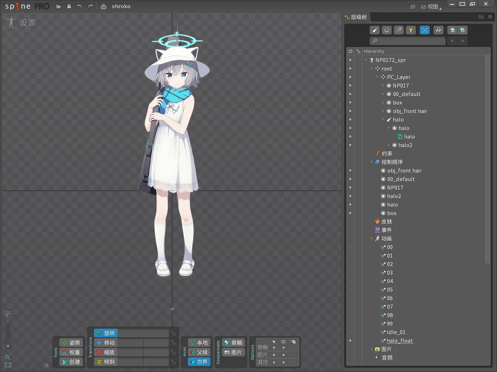
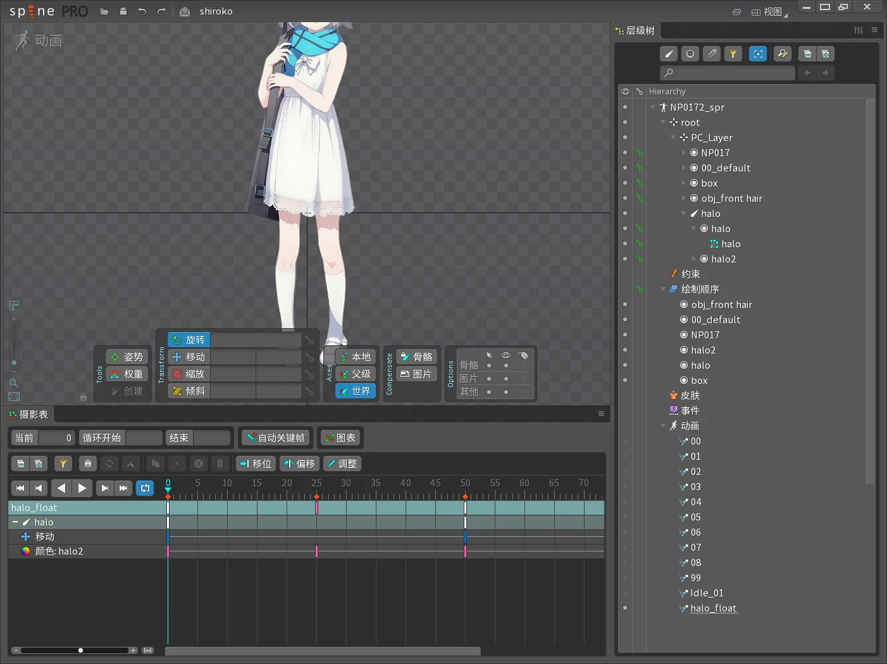

在视口中，常用的基本操作有：

- 平移：按住鼠标右键并拖动，可在视口中平移视图
- 缩放：通过向上/向下滚动鼠标滚轮，可对目标区域进行放缩观察
- 移动/旋转模式：点击鼠标右键可切换模式。启用后，在视口中按住鼠标左键并拖动，即可控制选中骨骼或图片的移动或旋转

### 层级树视图

[层级树视图](https://zh.esotericsoftware.com/spine-tree)为骨架及其包含的所有内容提供了一个层次结构视图:

- [**骨架**](https://zh.esotericsoftware.com/spine-skeletons)
  - 表示可设置动画的角色或对象
  - 包含骨骼、插槽、附件和其他部分
- [**骨骼**](https://zh.esotericsoftware.com/spine-bones)
  - 构成骨架的层级化关节
  - 每个骨架只能有一个根骨骼
  - 其长度通常不重要
  - 每个骨骼都具有旋转、平移、缩放和剪切属性
  - 骨骼与骨骼之间可以有父子关系，骨骼的变换会影响其子骨骼
- [**插槽**](https://zh.esotericsoftware.com/spine-slots)
  - 只是概念性的，没有位置，也不会绘制
  - 是骨骼的子级，也是附件的容器
  - 用于管理显示，在任何给定时间只有一个附件（或没有附件）可见
  - 骨架的绘制顺序就是一个插槽列表
- [**附件**](https://zh.esotericsoftware.com/spine-attachments)
  - 附加在插槽上，因此骨骼变换时，附件也会变换
  - 附件可以是图片或者边界框
  - 可以添加到皮肤
- 其他部分
  - [**约束**](https://zh.esotericsoftware.com/spine-constraints)
  - [**绘制顺序**](https://zh.esotericsoftware.com/spine-slots#%E7%BB%98%E5%88%B6%E9%A1%BA%E5%BA%8F)
  - [**皮肤**](https://zh.esotericsoftware.com/spine-skins)
  - [**事件**](https://zh.esotericsoftware.com/spine-events)
  - [**动画**](https://zh.esotericsoftware.com/spine-animations-view)

某些层级树节点在层级树的左侧边缘可能有：

- 可见点：单击可见点后将显示或隐藏该项目
- 钥匙按钮：在动画模式下，单击该钥匙将为该项目设置一个关键帧

在层级树种选择某个项后，其属性将显示在层级树的底部。这些属性是项目中的项的配置位置。某些属性只能在选择单个节点时进行编辑。大多数属性的右上角都有三个相同的按钮，分别用于复制、重命名和删除。

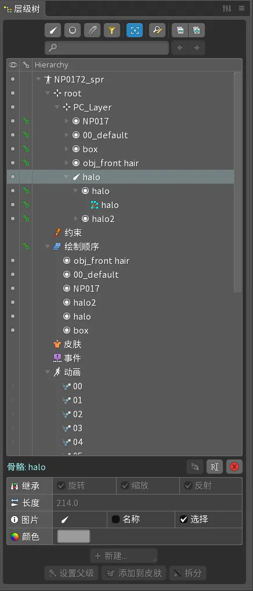

### 纹理解包器

**纹理图集**由一个文件扩展名为“.atlas”的图集文件和一个或多个称为图集“页面图片”的图片文件组成。图集文件描述每个打包的较小图片在页面图片中的位置，称为图集“区域”。这些区域在图集文件中按名称引用。纹理图集可在项目导出数据时打包后可以得到。

一个纹理图集可以包含多个页面图片，从而可将应用程序的所有图片打包到单个图集中。

**纹理解包器**可读取纹理图集，并从中根据图集文件将一个或多个页面图片分解成多个较小的图片。

打开操作路径：`Spine 标志`(左上角) → `主菜单` → `纹理解包器`。

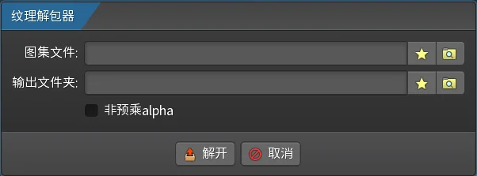

## Spine Web Player

要在 Firefly 主题中通过 Spine Web Player 渲染模型。需完成以下工作：准备好模型的资源文件，选择适配的 Spine Web Player 版本，且在必要时使用 Spine 编辑器重新导出资源文件。

相关文档链接：

- [Spine Web Player](https://zh.esotericsoftware.com/spine-player)
- [Spine 运行时指南](https://zh.esotericsoftware.com/spine-runtimes-guide)

### 资源文件

从网上下载下来的 Spine 模型资源文件，必须包含三个文件：

- 骨骼数据文件
  - 包含了骨骼结构、动画、约束、皮肤等信息，但不包含图片
  - 格式：`.json` 或 `.skel`（二进制格式）
- 图集文件
  - 记录了角色所有拆分散图是如何从一张（或多张）大图中拼接出来的
  - 格式：`.atlas`，一个纯文本文件，里面定义了：
    - 使用了哪张（些）大图（`.png`）
    - 每个小部件（如“左手”、“头部”、“武器”）在大图中的精确位置（`x`，`y`，`width`，`height`）
    - 以及其他渲染信息（如旋转、偏移等）
- 纹理文件
  - 一张或多张“图集大图”，由 Spine 编辑器自动将拆分好的所有小部件打包生成
  - 格式：`.png`（最常用）
  - 例如：一个角色可能只有一张 `role1.png`，它里面就包含了这个角色的所有身体部件

### 版本

Spine Web Player 的版本号（主版本号.次版本号）必须与用来导出 skeleton 和 atlas 的 Spine 编辑器版本相匹配。用来导出的 Spine 编辑器版本会被记录在导出来的骨骼数据文件里，不管是 JSON 格式还是二进制格式，都可以借助 **VSCode** 打开后轻易地看出来。例如：

```text showLineNumbers=false
{"skeleton":{"hash":"lzvNuUiXxTkT73S+7cJC27oo7Q0","spine":"3.8.75","x":-290.8,...
```

上面是某个模型的 JSON 格式的骨骼数据文件内容，其中，`spine` 字段的值就是用来导出的 Spine 编辑器版本，这表明应该用 3.8 版本的 Spine Web Player 去加载该模型。

### 重导出

有时从网上下载了模型资源文件，预览后发现有些不太满意的地方，或者想调整下导出资源时的关键设置，如图片资源更新，动画调整，输出格式调整，图集设置调整等。调整后，重新导出令人满意的“核心三件套”：骨骼数据文件、图集文件和纹理大图。

如果下载的资源还附带了 Spine 项目文件 `.spine`，那重导出的过程就很简单。但要是没有附带了 Spine 项目文件 `.spine`，那可能没那么容易调整了。幸运的是，仅凭骨骼数据文件、图集文件和纹理大图，在大多数情况下是可以还原出可用的 Spine 项目文件的。可以还原的部分有：

- 骨骼结构、插槽、附件
- 动画数据
- 纹理与图集映射

有些部分内容没法还原。不管怎样，能够还原出 Spine 项目文件的完整程度主要取决于之前导出“核心三件套”的完整程度。

### API 中关键概念

#### RGBA8888

**RGBA8888** 是一种像素颜色存储格式，用红（R）、绿（G）、蓝（B）、透明度（A）四个通道存储颜色，“8888”则表示每个通道占用 8 比特。值得注意的是，A 实际代表“不透明度”而不是“透明度”，也就是说 A=0 是完全透明，A=255 是完全不透明。例如：`0xFF0000FF` 标识不透明的红色（即 R=255, G=0, B=0, A=255）。

#### 预乘 Alpha

正如字面意思，**预乘 Alpha**（**Premultiplied Alpha**）就是让 RGB 通道预先与 A 通道相乘，A 通道仍独立存储。官方建议对所有 Spine Web Player 需显示的资产均使用预乘 Alpha，它减少了不使用预乘 Alpha 时可能出现的伪影和接缝问题。

#### 视口

在 Spine Web Player 中，**视口**是指骨架所在的世界坐标空间中的一个矩形区域，再加上填充量。

默认情况下，播放器会根据动画边界框并在四周加上默认 10% 的填充自动生成一个视口。在初始化播放器的时候，可以传入 `viewport` 字段来配置全局视口或动画专属视口。

`viewport` 字段接受以下子字段：

- `x`、`y`: 指定视口左下角在骨架的世界坐标空间中的位置
- `width`、`height`：指定视口的尺寸
- `padLeft`、`padRight`、`padTop`、`padBottom`：指定要添加到视口各边的填充量
- `animations`：为特定动画指定专属的视口设置

在 Spine 的二维视图中，X 轴是水平轴（从左到右），Y 轴是垂直轴（从下到上）。

不管使用什么样的视图，播放器会保持视口长宽比，然后将视口嵌入到播放器的可用空间中。这过程中可能会保持长宽比缩放视口的显示内容，最终显示在播放器的内容可能溢出视口范围。为了方便调试，可以通过指定 `debugRender` 字段来可视化视口。

#### 轨道

**轨道**（**Track**）用于分层应用动画功能。每个轨道都存储了一个动画和其播放参数，并通过一个从零开始的编号进行索引，该编号在运行时对应其内部数组下标。系统会按照轨道编号从小到大的顺序，依次应用各个轨道上的动画。

多轨道设计使得角色的各个部位可以独立播放动画。通过分别控制各轨道上的动画，能够复用动画资源，并动态组合出复杂的动作。例如，要创建“移动中射击”的动画，只需在轨道 0 上设置脚部移动动画，在轨道 1 上设置手臂射击动画，两者同时播放即可实现。

### API 中的一些类

尽管 Spine Web Player 在运行时运用到了很多类，但对于我的需求来说，只有几个类需要稍微了解一下。

[**Animation**](https://zh.esotericsoftware.com/spine-api-reference#Animation) 就是动画实例，存储着动画的一个时间轴的列表。[**AnimationState**](https://zh.esotericsoftware.com/spine-api-reference#AnimationState) 相当于动画的“总导演”，控制和管理着动画的播放。[**TrackEntry**](https://zh.esotericsoftware.com/spine-api-reference#TrackEntry) 是轨道条目，存储着动画播放的设置和其他状态。

AnimationState 管理着多个轨道插槽。每个轨道插槽都是一个双向队列，管理着多个 TrackEntry，指明了动画播放顺序。每个 TrackEntry 存储着应用于该轨道条目的 Animation。

就我的需求而言，除了初始化播放器的必要调用外，仅需使用 AnimationState 的 [`setAnimation (	int trackIndex, string animationName, bool loop): TrackEntry`](https://zh.esotericsoftware.com/spine-api-reference#AnimationState-setAnimation) 方法就足够了。

## Demo

由于直接修改 Firefly 主题源码涉及代码段较长且分散，不利于逐步讲解，因此我将首先实现一个简单的 Demo。此外，在前期用较短代码实现核心功能，即使出了问题也容易定位和调试，之后再将验证过的方案集成到主题中。

根据之前列出的看板娘需求，以及目前主题源码中看板娘的实现，Demo 要实现的功能有：

- 显示看板娘
- 点击时，看板娘的眼睛和口型将变化，一段时间后自动恢复
- 看板娘头上的光环始终保持上下浮动

剩余的需求无需在 Demo 中实现，因为它们要么已被主题直接支持，要么只需简单配置即可满足。

### 1. 查看模型版本

在引入 Spine Web Player 到页面前，需要先确认导出模型文件的 Spine 编辑器版本。这是确保运行时兼容的关键步骤。

用 VSCode 打开先前下载的模型资源文件夹中的 `NP0172_spr.skel` 文件，在弹出的警告窗口中点击 `Open Anyway` 按钮，并在顶部选择 `Text Editor` 项。打开后，在第一行中可看到 `3.8.96` 字样。由此可知，该看板娘是由 Spine 编辑器 3.8.96 版本导出的。

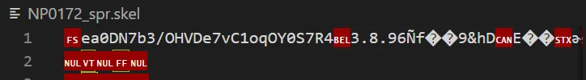

### 2. 引入 Spine Web Player

[Spine 运行时版本号使用 `majar.minor` 格式](https://zh.esotericsoftware.com/spine-versioning)。在搜索引擎和 CDN 网站上难以搜到 Spine Web Player 3.8 的 JavaScript 和 CSS 资源链接。不过，最终还是在 [Spine 运行时 GitHub 存储库](https://github.com/EsotericSoftware/spine-runtimes/tree/3.8)中找到了 3.8 版本构建后的 [`build/spine-player.js`](https://github.com/EsotericSoftware/spine-runtimes/blob/3.8/spine-ts/build/spine-player.js) 文件、构建前的 [`player/src/Player.ts`](https://github.com/EsotericSoftware/spine-runtimes/blob/3.8/spine-ts/player/src/Player.ts) 文件和 [`player/css/spine-player.css`](https://github.com/EsotericSoftware/spine-runtimes/blob/3.8/spine-ts/player/css/spine-player.css) 文件。之后，引入的时候要用 `spine-player.js` 文件，而在参考 API 的时候要查阅 `Player.ts` 文件，毕竟官网 Spine 运行时 API 文档是基于最新版本 4.3.x 的。

创建 `spine-web-player-demo` 目录，接下来在该目录中创建以下文件与子目录结构：

```text showLineNumbers=false
spine-web-player-demo
├── server.js
└── public
    ├── index.html
    ├── NP0172_spr.atlas
    ├── NP0172_spr.png
    ├── NP0172_spr.skel
    ├── spine-player.css
    └── spine-player.js
```

出于安全考虑，大多数现代浏览器在 `file://` 上下文中不允许通过 `fetch` 或 `XMLHttpRequest` 加载本地文件，因此需要搭建一个本地服务器：

```javascript title="server.js"
const http = require('http');
const fs = require('fs');
const path = require('path');

const PORT = 3000;
const ROOT_DIR = './public';

// MIME 类型映射
const MIME = {
  '.js': 'text/javascript',
  '.css': 'text/css',
  '.json': 'application/json',
  '.png': 'image/png',
  '.skel': 'application/octet-stream',
  '.atlas': 'text/plain; charset=utf-8',
  '.html': 'text/html'
};

const server = http.createServer((req, res) => {
  // 默认首页
  let filePath = path.join(ROOT_DIR, req.url === '/' ? 'index.html' : req.url);

  // 获取扩展名
  const ext = path.extname(filePath).toLowerCase();
  const contentType = MIME[ext] || 'application/octet-stream';

  // 判断是否用文本模式（utf8）读取
  const isText = ['.js', '.css', '.json', '.atlas', '.html'].includes(ext);

  fs.readFile(filePath, isText ? 'utf8' : null, (err, data) => {
    if (err) {
      res.writeHead(404);
      res.end('404');
    } else {
      res.writeHead(200, { 'Content-Type': contentType });
      res.end(data);
    }
  });
});

server.listen(PORT, () => {
  console.log(`Local test server running at http://localhost:${PORT}`);
});
```

将 Spine Web Player 的 JavaScript 和 CSS 文件引入到页面：

```html title="index.html"
<!DOCTYPE html>
<html lang="en">
<head>
  <meta charset="UTF-8">
  <meta name="viewport" content="width=device-width, initial-scale=1.0">
  <title>Spine Web Player Demo</title>
  <link rel="stylesheet" href="spine-player.css">
</head>
<body>
  <script src="spine-player.js"></script>
  
</body>
</html>
```

### 3. 显示看板娘

参考 Spine Web Player 文档和 `Player.ts` 文件源码，将播放器嵌入到页面上。在 `<body>` 标签里：

```html title="index.html"
<div id="player-container" style="width: 640px; height: 480px;"></div>

<script src="spine-player.js"></script>
<script>
  new spine.SpinePlayer("player-container", {
    skelUrl: "NP0172_spr.skel",
    atlasUrl: "NP0172_spr.atlas",
    showControls: true,
    // 背景透明
    alpha: true,
    backgroundColor: "#00000000",
    premultipliedAlpha: true,
  });
</script>
```

运行命令：
```bash
node server.js
```

通过 `showControls` 配置属性来显示播放器的控件，这样可以手动切换动画。

在浏览器中访问 `http://localhost:3000`，观察到看板娘的脸部显示存在异常，出现了较大面积的空白区域：

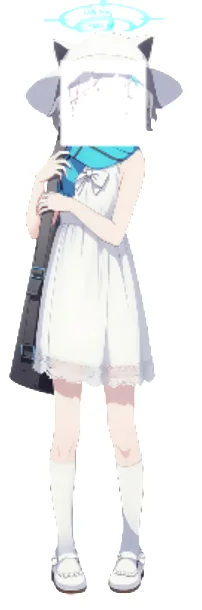

尝试将 `premultipliedAlpha` 字段的值设置成 `false`：


结果看板娘的脸部显示仍然存在异常：前部头发偏白色。这可能是因为作者用 Spine 编辑器导出资源时，没启用“预乘 Alpha”。

可以使用 **ImageMagick** 工具快速解决该问题：

```bash
magick public/NP0172_spr.png -channel RGB -fx "u*a" public/NP0172_spr.png
```

针对图集的 RGB 通道，将像素值(u)乘以透明度(a)，A 通道保持不变。这完全符合 Spine 的预乘定义。

仍然将 `premultipliedAlpha` 字段的值为 `true`，再次测试，此时看板娘的显示正常。

### 4. 还原 Spine 项目

现在，当页面上播放器显示出看板娘时，就会自动开始播放动画。

通过底部控件右方的动画选择器，可以手动切换当前活动的动画。在反复切换不同动画后发现存在以下问题：

- 切换动画时，模型会轻微上下位移
- 看板娘头上的光环没有浮动（如 `01` 动画）或者浮动幅度过小（如 `Idle_01` 动画）

至于轻微上下位移的问题，是由于初始化播放器时未通过 `viewport` 字段手动指定视口位置和尺寸，播放器此时会自动计算并设置视口。若需手动指定 `viewport` 字段，则需要提前获取骨架所在世界坐标空间中的位置和尺寸。

使用 Spine 编辑器就能很好地解决这两个问题，所以接下来要先还原出 Spine 项目。

打开 Spine 编辑器后，点击 `Spine 标志`(左上角) → `主菜单` → `导入数据` 导入 `NP0172_spr.skel` 骨骼数据：

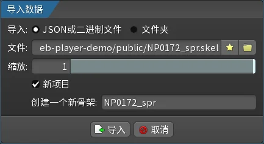

导入成功后，会提示贴图缺失：

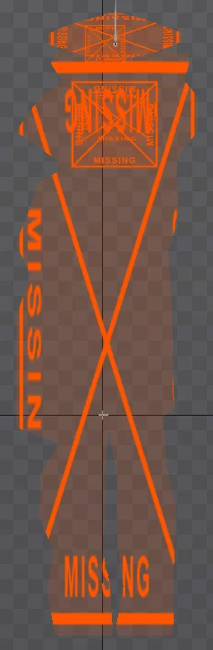

所以接下来要导入贴图，点击 `Spine 标志`(左上角) → `主菜单` → `纹理解包器`，`图集文件`选择 `NP0172_spr.atlas`，`输出文件夹`路径随意，不勾选 `非预乘 alpha` 选项：

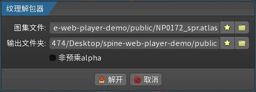

点击 `解开` 按钮。解包成功后，在输出文件夹里会发现纹理文件被拆成多张贴图。

在右侧层级树视图中选择 `动画` 节点，其属性将显示在层级树视图的底部，然后选择刚才的输出文件夹路径作为`图片文件`的`路径`：

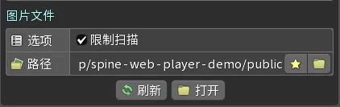

这样，就成功通过模型资源文件还原得到 Spine 项目文件了。

### 5. 分离并修改光环动画

为了使看板娘头顶上的光环浮动效果更明显，可以加大光环上下浮动的距离。同时，为了避免动画切换时，光环出现“瞬移”现象，有必要将光环浮动动画独立出来。这样，点击后看板娘的眼睛和口型发生变化时，光环浮动动画不会受到影响。

在 Spine 编辑器中，点击视口左上角的图标切换到动画模式，然后展开层级树视图中`动画`节点，接着依次展开 `root` > `PC_Layer` > `halo` 节点。

可以通过点击动画节点的子节点左边的可见点来显示或隐藏对应的动画，但每次只能显示一个。

显示动画后，选中 `root` 节点或其子节点，就能在左侧视口底部的摄影表视图中看见该节点的关键帧变化，同时视图底部的主工具栏会显示旋转、移动、缩放、倾斜等参数。按住 `Ctrl` 键可以进行多选。按 `Esc` 键可取消选中这些节点，此时摄影表视图中会显示当前动画所涉及到的节点及其所有关键帧。

拖动摄影表视图里的时间轴或者点击 `▶` 按钮，可以播放当前显示中的动画。

经过反复操作可以发现：

- 光环在 `halo` 插槽中
- 仅 `Idle_01` 动画里有光环的浮动效果，`PC_Layer` 骨骼有轻微移动
- 其他动画里光环没有浮动效果，`PC_Layer` 骨骼没有移动，但有眼睛和口型的变化

为了实现动画分层，需要创建一个单独用于光环的 `halo_float` 动画：

1. 在层级树视图中选中 `Idle_01` 动画节点，点击底部属性右下第一个按钮来复制该节点
2. 将新的动画节点重命名为 `halo_float`

紧接着将光环上下浮动效果调整得更明显：

1. 选中 `halo` 骨骼节点，在摄影表视图里选中第 50 帧，在主工具栏中，将`移动`字段的 `1251.8` 改成 `1274.3`
2. 点击旁边的红色钥匙按钮，设置一个移动的关键帧

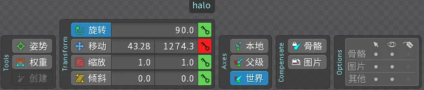

最后将多余的动画效果删除，注意不要遗漏第 0 帧的关键帧：

1. 选中 `PC_Layer` 骨骼节点，在摄影表视图里将 `PC_Layer` [**骨骼行**](https://zh.esotericsoftware.com/spine-dopesheet#%E9%AA%A8%E9%AA%BC%E8%A1%8C)里的 `移动` [**属性行**](https://zh.esotericsoftware.com/spine-dopesheet#%E5%B1%9E%E6%80%A7%E8%A1%8C)中的关键帧全部删除
2. 点击 `Idle_01` 动画节点左边的可见点，然后选中 `halo` 骨骼节点，在摄影表视图中将 `halo` 骨骼行的所有属性行中的关键帧全部删除

### 6. 导出资源

点击 `Spine 标志`(左上角) → `主菜单` → `导出...`，`数据` 字段选择 `JSON`，输出文件夹路径随意，`纹理图集` 字段勾选 `打包` → 选择 `附件`：

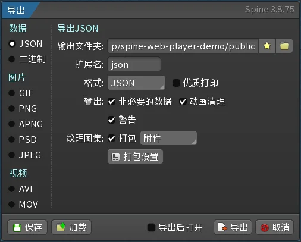

然后点击 `打包设置` 按钮弹出 `纹理打包器设置` 窗口，勾选 `输出` 部分里的 `预乘 Alpha` 选项：

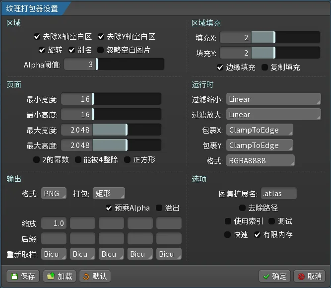

点击 `确定` 按钮返回到上一个窗口，接着点击 `导出` 按钮导出资源。

导出资源完毕后，确保 `public` 目录下至少要包含：

```text showLineNumbers=false
public
├── index.html
├── NP0172_spr.atlas
├── NP0172_spr.json
├── NP0172_spr.png
├── spine-player.css
└── spine-player.js
```

### 7. 修改 Spine 版本号

由于当前已改用 JSON 格式的骨骼数据文件，因此代码中在指定骨骼数据文件路径时，应当使用 `jsonUrl` 字段替代原先的 `skelUrl` 字段：

```diff lang="javascript" title="index.html"
-skelUrl: "NP0172_spr.skel",
+jsonUrl: "NP0172_spr.json",
```

此时尝试运行会发现，Spine 播放器提示错误：

```text showLineNumbers=false
Error: could not load skeleton .json.
Error: Unsupported skeleton data, please export with a newer version of Spine.
```

用 VSCode 编辑 `NP0172_spr.json` 文件，将开头的 `spine` 字段修改：

```diff title="NP0172_spr.json"
- {"skeleton":{"hash":"yYnv88Uea00W/bB6gcmM/ZQmLSA","spine":"3.8.75"... }}
+ {"skeleton":{"hash":"yYnv88Uea00W/bB6gcmM/ZQmLSA","spine":"3.8.99"... }}
```

再次尝试运行，这次可正常显示了。经测试，实际上可以将它改成任意 `3.8.x`，只要不是 `3.8.75` 即可。

### 8. 测量视口区域

为了避免动画切换时可能出现的轻微位移现象，可以预先在代码中固定好视口的位置和尺寸。虽然 `Idle_01` 动画中的看板娘实际上会移动约 2.5 像素，但这一变化在视觉上很难被察觉。

通过单击视口中缩放滑块上方的标尺按钮可以显示标尺。标尺单位采用世界坐标，与尚未缩放的图片的像素相对应。标尺上，每大格代表 500 像素。每个大格均分为 8 小格，故每小格代表 62.5 像素。

初始化播放器时，为了自定义 `viewport` 字段的值，需要用标尺去分别测量看板娘左下角处的位置和看板娘尺寸。这结果大概分别为 `(-300,-750)` 和 `625×2150`。

```javascript title="index.html"
viewport: {
  padLeft: 0,
  padRight: 0,
  padTop: 0,
  padBottom: 0,
  x: -300,
  y: -750,
  width: 625,
  height: 2150,
  debugRender: true,
}
```

### 9. 添加交互

使用 AnimationState 的 `setAnimation (	int trackIndex, Animation animation, bool loop): TrackEntry` 方法可以实现动画分层：

- 轨道 0：用于播放 `Idle_01` 或眼睛和口型变化的动画
- 轨道 1：持续循环播放 `halo_float` 动画

经过分层处理后，动画效果更加自然。即使看板娘的表情和口型发生变化，其头顶光环的浮动位置也不会被重置。

还有，看板娘眼睛和口型发生变化后，在经过一段时间（如 1500ms）后会恢复原状：

```javascript title="index.html"
showControls: false, // 隐藏控件
animation: "Idle_01", // 初始播放动画
success: (player) => {
  player.animationState.setAnimation(1, "halo_float", true);

  isClickable = true;
  document.getElementById("player-container").addEventListener("click", () => {
    if (!isClickable) return;

    isClickable = false;
    const animations = ["00", "01", "02", "04", "05", "06", "07", "08", "99"];
    const randomIndex = Math.floor(Math.random() * animations.length);
    const selectedAnimation = animations[randomIndex];
    player.animationState.setAnimation(0, selectedAnimation, true);
    setTimeout(() => {
      player.animationState.setAnimation(0, "Idle_01", false);
      isClickable = true;
    }, 1500);
  });
},
```

至此，本 Demo 就实现完毕了。

## 修改源码

一旦将 Demo 实现出来后，就能够快速地修改 Firely 主题源码去实现之前提到的完整需求了。

### 1. 更换模型文件

Firefly 主题的 `public/pio/models/spine` 目录存放着 Spine 看板娘的数据文件。删除该目录下的 `firefly` 目录，然后新建一个名为 `shiroko` 的目录，并将之前导出的资源文件复制到 `shiroko` 目录中。

```text showLineNumbers=false
spine
└── shiroko
    ├── NP0172_spr.atlas
    ├── NP0172_spr.json
    └── NP0172_spr.png
```

### 2. 更换 JavaScript 和 CSS 文件

目前，Spine Web Player 所需的 JavaScript 和 CSS 文件存放在主题 `public/pio/static` 目录中，对应文件名分别为 `spine-player.min.js` 和 `spine-player.min.css`。

当前 Firefly 主题源码引入的 Spine Web Player 版本为 4.2.x，而用于导出看板娘的 Spine 编辑器版本为 3.8.75。为保持版本兼容性，需要将相关文件替换为对应的 3.8 版本。

操作时要注意：

- 使用 Spine Web Player 3.8 版本的官方 `spine-player.js` 和 `spine.player.css` 文件
- 分别通过 [Minify JS Online](https://minify-js.com) 和 [Minify CSS Online](https://minify-css.com) 对代码进行压缩
- 将压缩后的内容分别覆盖至现有的 `spine-player.min.js` 和 `spine-player.min.css` 文件

### 3. 修改配置类型文件

由于主版本号不同，之间的 API 定义可能存在差异。此外，当前的看板娘配置类型定义也较为粗糙，有必要进一步优化调整。

主题的配置类型都定义在 `src/types/config.ts` 文件中。将 Spine 看板娘配置类型的定义修改为：

```diff lang="typescript" title="src/types/config.ts"
// Spine 看板娘配置
export type SpineModelConfig = {
  enable: boolean; // 是否启用 Spine 看板娘
  model: {
-    path: string; // 模型文件路径 (.json)
-    scale?: number; // 模型缩放比例，默认1.0
-    x?: number; // X轴偏移，默认0
-    y?: number; // Y轴偏移，默认0
-  };
+    path: string; // 模型文件路径 (.json) 或 (.skel)
+  };
+  atlas: {
+    path: string; // 模型纹理文件路径 (.atlas)
+  };
+  premultipliedAlpha?: boolean; // 是否使用预乘Alpha，默认true
  position: {
    corner: "bottom-left" | "bottom-right" | "top-left" | "top-right"; // 显示位置
    offsetX?: number; // 水平偏移量，默认20px
    offsetY?: number; // 垂直偏移量，默认20px
  };
-  size: {
+  size?: {
    width?: number; // 容器宽度，默认280px
    height?: number; // 容器高度，默认400px
-  };
+    zoom?: number; // 缩放比例，默认1.0
+  };
+  viewport?: {
+    x?: number; // 视口X坐标
+    y?: number; // 视口Y坐标
+    width?: number; // 视口宽度
+    height?: number; // 视口高度
+    padLeft?: string | number; // 视口左侧内边距
+    padRight?: string | number; // 视口右侧内边距
+    padTop?: string | number; // 视口上侧内边距
+    padBottom?: string | number; // 视口下侧内边距
+    debugRender?: boolean; // 是否启用调试渲染
+  };
+  animations: {
+    initial: string; // 初始动画
+    idle: string[]; // 待机动画列表
+    idleInterval?: number; // 待机动画切换间隔（毫秒），默认10000
+    persistent: string[]; // 持续播放的动画列表
+  },
  interactive?: {
    enabled?: boolean; // 是否启用交互功能，默认true
    clickAnimations?: string[]; // 点击时随机播放的动画列表
    clickMessages?: string[]; // 点击时随机显示的文字消息
    messageDisplayTime?: number; // 文字显示时间（毫秒），默认3000
-    idleAnimations?: string[]; // 待机动画列表
-    idleInterval?: number; // 待机动画切换间隔（毫秒），默认10000
  };
  responsive?: {
    hideOnMobile?: boolean; // 是否在移动端隐藏，默认false
    mobileBreakpoint?: number; // 移动端断点，默认768px
  };
  zIndex?: number; // 层级，默认1000
  opacity?: number; // 透明度，0-1，默认1.0
};
```

引入 `zoom` 字段可以灵活调整看板娘容器的显示尺寸，且缩放效果相较于其他实现方式更为平滑流畅。

### 4. 修改配置文件

Spine 看板娘相关配置在 `src/config/pioConfig.ts` 文件中，修改为：

```diff lang="typescript" title="src/config/pioConfig.ts"
-// Spine 看板娘配置
+// Spine 看板娘配置（版本 3.8）
export const spineModelConfig: SpineModelConfig = {
-  enable: false, // 启用 Spine 看板娘
+  enable: true, // 启用 Spine 看板娘
  model: {
    // Spine模型文件路径
-    path: "/pio/models/spine/firefly/1310.json",
-    scale: 1.0, // 模型缩放比例
-    x: 0, // X轴偏移
-    y: 0, // Y轴偏移
-  },
+    path: "/pio/models/spine/shiroko/NP0172_spr.json",
+  },
+  atlas: {
+    // Spine模型纹理文件路径
+    path: "/pio/models/spine/shiroko/NP0172_spr.atlas",
+  },
+  premultipliedAlpha: true, // 使用预乘Alpha
  position: {
    // 显示位置 bottom-left，bottom-right，top-left，top-right，注意：在右下角可能会挡住返回顶部按钮
    corner: "bottom-left",
    offsetX: 0, // 距离右边缘0px
    offsetY: 0, // 距离底部0px
  },
  size: {
-    width: 135, // 容器宽度
-    height: 165, // 容器高度
+    width: 625, // 容器宽度
+    height: 2150, // 容器高度
+    zoom: 0.18, // 容器缩放比例
+  },
+  viewport: {
+    padLeft: 0,
+    padRight: 0,
+    padTop: 0,
+    padBottom: 0,
+    x: -300,
+    y: -750,
+    width: 625,
+    height: 2150,
+    debugRender: false,
+  },
+  animations: {
+    initial: "Idle_01", // 初始动画
+    idle: ["Idle_01"], // 待机动画列表
+    idleInterval: 8000, // 待机动画切换间隔（8秒）
+    persistent: ["halo_float"] // 持续播放的动画列表
  },
  interactive: {
    enabled: true, // 启用交互功能
-    clickAnimations: [
-      "emoji_0",
-      "emoji_1",
-      "emoji_2",
-      "emoji_3",
-      "emoji_4",
-      "emoji_5",
-      "emoji_6",
-    ], // 点击时随机播放的动画列表
-    clickMessages: [
-      "你好呀！我是流萤~",
-      "今天也要加油哦！✨",
-      "想要一起去看星空吗？🌟",
-      "记得要好好休息呢~",
-      "有什么想对我说的吗？💫",
-      "让我们一起探索未知的世界吧！🚀",
-      "每一颗星星都有自己的故事~⭐",
-      "希望能带给你温暖和快乐！💖",
+    clickAnimations: ["00", "01", "02", "04", "05", "06", "07", "08", "99"], // 点击时随机播放的动画列表
+    clickMessages: [ // ---
+      "欢迎来到这个小小的空间~",
+      "今天也请享受探索的乐趣吧！",
+      "发现什么有趣的内容了吗？",
+      "要喝杯茶休息一下吗？",
+      "希望你能在这里找到需要的信息",
+      "阳光正好，是个适合阅读的日子",
+      "每个角落都藏着小小惊喜",
+      "感谢你的到访，愿你有个美好的一天",
+      "这里记录着思考和成长的痕迹",
+      "慢慢来，享受这段时光",
    ], // 点击时随机显示的文字消息
    messageDisplayTime: 3000, // 文字显示时间（毫秒）
-    idleAnimations: ["idle", "emoji_0", "emoji_1", "emoji_3", "emoji_4"], // 待机动画列表
-    idleInterval: 8000, // 待机动画切换间隔（8秒）
  },
  responsive: {
    hideOnMobile: true, // 在移动端隐藏
    mobileBreakpoint: 768, // 移动端断点
  },
  zIndex: 1000, // 层级
  opacity: 1.0, // 完全不透明
};
```

这里也同时调整了点击看板娘时随机显示的文字消息内容。

### 5. 修改看板娘展示组件

`src/components/widget/SpineModel.astro` 文件为看板娘的核心展示组件。根据新版配置做适配修改，以确保所有配置项能够正确应用。

**修改点 1：调整 HTML 元素属性**

```diff lang="typescript" title="src/components/widget/SpineModel.astro"
<!-- Spine Web Player CSS 将在 script 中动态加载 -->{
  spineModelConfig.enable && (
    <div
+      id="spine-model-container"
+      style={`
+      position: fixed;
+      ${spineModelConfig.position.corner.includes("right") ? "right" : "left"}: ${spineModelConfig.position.offsetX}px;
+      ${spineModelConfig.position.corner.includes("top") ? "top" : "bottom"}: ${spineModelConfig.position.offsetY}px;
-      width: ${spineModelConfig.size.width}px;
-      height: ${spineModelConfig.size.height}px;
      pointer-events: auto;
      z-index: 1000;
    `}
    >
-      <div id="spine-player-container" style="width: 100%; height: 100%;" />
+      <div
+        id="spine-player-container"
+        style={`
+          width: ${spineModelConfig?.size?.width || 280}px;
+          height: ${spineModelConfig?.size?.height || 400}px;
+          zoom: ${spineModelConfig?.size?.zoom || 1};
+        `} />
      <div id="spine-error" style="display: none;" />
    </div>
  )
}
```

**修改点 2：更正 Altas 路径**

```diff lang="typescript" title="src/components/widget/SpineModel.astro"
- <script define:vars={{ spineModelConfig, modelPath: url(spineModelConfig.model.path), atlasPath: url(spineModelConfig.model.path.replace(".json", ".atlas")), cssPath: url("/pio/static/spine-player.min.css"), jsPath: url("/pio/static/spine-player.min.js") }}>
+ <script define:vars={{ spineModelConfig, modelPath: url(spineModelConfig.model.path), atlasPath: url(spineModelConfig.atlas.path), cssPath: url("/pio/static/spine-player.min.css"), jsPath: url("/pio/static/spine-player.min.js") }}>
```

**修改点 3：修改 CDN 链接**

源代码目前优先尝试从 CDN 获取 Spine Web Player 4.2 版本的 JavaScript 和 CSS 文件；若获取失败，则回退到本地服务器资源。由于目前尚未找到 3.8 版本的公开 CDN 地址，为了简化修改并避免大规模调整代码，我将原 CDN 链接直接替换为指向本地服务器的相同文件路径。这样，将始终从本地加载 3.8 版本的文件，虽然可能在回退逻辑下触发两次本地请求，但整体逻辑保持简洁、易于维护。

```diff lang="typescript" title="src/components/widget/SpineModel.astro"
- cdnLink.href =
-   "https://unpkg.com/@esotericsoftware/spine-player@4.2.*/dist/spine-player.min.css";
+ cdnLink.href = cssPath;
```

```diff lang="typescript" title="src/components/widget/SpineModel.astro"
- script.src =
-   "https://unpkg.com/@esotericsoftware/spine-player@4.2.*/dist/iife/spine-player.min.js";
+ script.src = jsPath;
```

**修改点 4：调整初始化播放器的参数**

```diff lang="typescript" title="src/components/widget/SpineModel.astro"
// 创建 SpinePlayer
const player = new window.spine.SpinePlayer("spine-player-container", {
-  skeleton: modelPath,
-  atlas: atlasPath,
-  animation: "idle",
+  jsonUrl: modelPath.endsWith(".json") ? modelPath : null,
+  skelUrl: modelPath.endsWith(".skel") ? modelPath : null,
+  atlasUrl: atlasPath,
+  animation: spineModelConfig.animations.initial,
  backgroundColor: "#00000000", // 透明背景
  showControls: false, // 隐藏控件
  alpha: true,
-  premultipliedAlpha: false,
+  premultipliedAlpha: spineModelConfig.premultipliedAlpha || true,
+  viewport: spineModelConfig.viewport,
  /* ... */
});
```

**修改点 5：调整动画逻辑**

目前，看板娘的动画播放是基于单轨道机制实现的。为了支持动画分层播放功能，接下来需要将代码改成基于多轨道的架构：

- 轨道 0（主动画层）：用于循环播放待机动画和响应点击交互
- 轨道 1 及以上（附加动画层）：持续播放背景或装饰性动画，实现动画叠加效果

这一调整将实现与之前 Demo 版本一致的分层动画效果。

```diff lang="typescript" title="src/components/widget/SpineModel.astro"
success: (player) => {
  console.log("🎉 Spine model loaded successfully!");

  // 保存播放器实例引用
  window.spinePlayerInstance = player;
+  
+  // 播放持续动画
+  spineModelConfig.animations.persistent.forEach((anim, i) => {
+    try {
+      player.animationState.setAnimation(i + 1, anim, true);
+    } catch (e) {
+      console.warn("Failed to play persistent animation:", e);
+    }
+  });

  // 初始化完成后设置默认姿态
  setTimeout(() => {
    if (player.skeleton) {
      try {
        player.skeleton.updateWorldTransform();
        player.skeleton.setToSetupPose();
      } catch (e) {
        console.warn("Error positioning skeleton:", e);
      }
    }
  }, 500);
+
+  // 设置待机动画循环
+  if (spineModelConfig.animations.idle.length > 1) {
+    setInterval(() => {
+      try {
+        const idleAnims =
+          spineModelConfig.animations.idle;
+        const randomIdle =
+          idleAnims[Math.floor(Math.random() * idleAnims.length)];
+        player.animationState.setAnimation(0, randomIdle, true);
+      } catch (e) {
+        console.warn("Failed to play idle animation:", e);
+      }
+    }, spineModelConfig.animations.idleInterval || 10000);
+  }

  // 设置交互功能
  if (spineModelConfig.interactive.enabled) {
    const canvas = document.querySelector(
      "#spine-player-container canvas"
    );
    if (canvas) {
      canvas.addEventListener("click", () => {
        // 防抖处理：防止重复点击
        const currentTime = Date.now();
        if (isClickProcessing || currentTime - lastClickTime < 500) {
          return; // 500ms 内重复点击忽略
        }

        isClickProcessing = true;
        lastClickTime = currentTime;

        // 随机播放点击动画
-        const clickAnims =
-          spineModelConfig.interactive.clickAnimations ||
-          (spineModelConfig.interactive.clickAnimation
-            ? [spineModelConfig.interactive.clickAnimation]
-            : []);
+        const clickAnims = spineModelConfig.interactive.clickAnimations

        if (clickAnims.length > 0) {
          try {
            const randomClickAnim =
              clickAnims[Math.floor(Math.random() * clickAnims.length)];
-            player.setAnimation(randomClickAnim, false);
+            player.animationState.setAnimation(0, randomClickAnim, false);

            // 动画播放完成后回到待机状态
            setTimeout(() => {
              const idleAnims =
-                spineModelConfig.interactive.idleAnimations;
+                spineModelConfig.animations.idle;
              const randomIdle =
                idleAnims[Math.floor(Math.random() * idleAnims.length)];
-              player.setAnimation(randomIdle, true);
+              player.animationState.setAnimation(0, randomIdle, true);
            }, 2000);
          } catch (e) {
            console.warn("Failed to play click animation:", e);
          }
        }

        // 显示随机消息
        const messages = spineModelConfig.interactive.clickMessages;
        if (messages && messages.length > 0) {
          const randomMessage =
            messages[Math.floor(Math.random() * messages.length)];
          showMessage(randomMessage);
        }

        // 500ms 后重置防抖标志
        setTimeout(() => {
          isClickProcessing = false;
        }, 500);
      });
-
-      // 设置待机动画循环
-      if (spineModelConfig.interactive.idleAnimations.length > 1) {
-        setInterval(() => {
-          try {
-            const idleAnims =
-              spineModelConfig.interactive.idleAnimations;
-            const randomIdle =
-              idleAnims[Math.floor(Math.random() * idleAnims.length)];
-            player.setAnimation(randomIdle, true);
-          } catch (e) {
-            console.warn("Failed to play idle animation:", e);
-          }
-        }, spineModelConfig.interactive.idleInterval);
-      }
    }
  }

  /* ... */
}
```

最后，访问 `http://localhost:3000/`，测试并确认各项功能正常。

## 收尾

### 提交更改并推送至线上

```bash
git rm -r public/pio/models/spine/firefly
git add public/pio/models/spine/shiroko
git add public/pio/static/spine-player.min.css
git add public/pio/static/spine-player.min.js
git add src/components/widget/SpineModel.astro
git add src/config/pioConfig.ts
git add src/types/config.ts
git commit -m "chore: 更换看板娘为 shiroko 并适配 Spine Web Player 3.8" -m "- 删除原看板娘 firefly，新增 看板娘 shiroko" -m "- 将 Spine Web Player 从 4.2 替换为 3.8" -m "- 调整看板娘配置类型定义" -m "- 更新看板娘配置项" -m "- 修改看板娘展示组件逻辑" -m "- 启用看板娘功能"
git push origin master
```

### 踩坑复盘

折腾了几天，新的看板娘终于完美地站在了我的博客角落。本以为就是“换个看板娘”这么简单，结果却耗在寻找更合适的看板娘、调试代码、以及反复踩坑上。为了跳出这些坑，我不得不学着使用各种新工具、理解一堆陌生概念，在尝试、失败、再尝试的循环里打转了好一阵子。

#### 踩坑过程

| 问题 | 推测原因 | 行动 |
| --- | --- | --- |
| 加载骨骼数据文件失败 | 使用的运行时库版本与导出该模型的编辑器版本不兼容 | 查找对应版本的运行时库 |
| 找不到稳定 CDN | 官方未提供旧版运行时库的 CDN | 下载文件到本地，之后跟着部署到 GitHub Pages |
| 仍然打不开骨骼数据文件 | 调用 API 时传入的字段名称不正确 | 根据正确版本的 API 定义填入正确的字段名 |
| 成功打开骨骼数据文件，但脸部显示异常 | --- | 尝试禁用预乘 Alpha |
| 背景色全黑 | --- | 开启透明通道并设置背景色 | 
| 发色出现异常 | --- | 重新启用预乘 Alpha |
| 脸部显示仍然异常 | 导出资源时未启用预乘 Alpha | 下载 Spine 编辑器 |
| Spine Trail 打不开骨骼数据文件 | Spine 编辑器版本不合适 | 改用其他版本的编辑器 |
| 导入骨骼数据文件至编辑器，图片显示不正常 | 缺少图片资源 | 用纹理解包器解包，之后指定解包后的图片路径 |
| Spine Web Player 打开刚导出的资源时提示版本不支持 | 版本不正确 | 尝试修改 JSON 格式的图集文件中的 spine 字段 |
| 看板娘显示成功，但在切换动画时她有轻微的上下位移 | 视口未固定 | 测量视口并正确配置 viewport 字段 |
| 看板娘显示有锯齿 | --- | 使用 CSS `zoom` 进行缩放 |
| 切换动画时，光环重置 | 在其他动画里光环没有移动 | 分离出光环浮动动画，借助轨道机制实现动画分层 |

别看上面写的“推测原因”和“行动”好像很准确，其实这些几乎都已经是整理后的“正确路径”了。当时真正的情况是：面对每个问题，我经常毫无头绪，甚至跑错方向。问了 AI，给的答案也常常不到位；最后只能迷茫地在网上搜来搜去，尝试各种可能根本不靠谱的方法。

#### 踩坑教训

1. 版本兼容性很重要：编辑器、运行时库、数据三者的版本必须严格兼容
2. 警惕 API 的静默变更：不同版本间接口或字段可能存在差异，查阅文档时需锁定对应版本，而非仅参考最新
3. 陌生概念是解题的钥匙：主动理解预乘 Alpha、轨道等核心概念，能从根本上定位问题，而非盲目尝试
4. 领域经验是解题的“直觉库”：在特定领域（如 2D 模型处理）积累的经验，能在遇到新问题时，更快地定位方向、形成假设，少走许多弯路